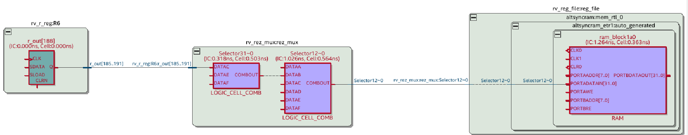
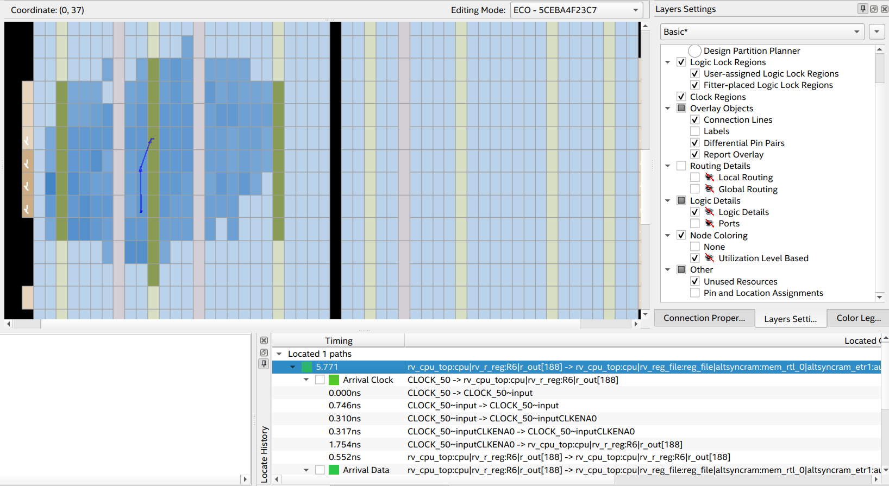

# XMOS-like Multithreaded RISC-V Processor

## Introduction
> Task: You have some design of a multithreaded RISC-V processor that you need to refactor. Additionaly you should implement some logic and synthesize this design for FPGA. The only thing you know that is can be simulated, so you must make sure that your module will sythesize correctly to desired megafuctions.

## Prerequisites
- Quartus® Prime Software Suite (Starter Edition will be sufficient);
- Cyclone V/IV FPGA Board;
- Python 3 Interpeter (for CSR map generation);
- Icarus Verilog v12.0 (for simulation purposes only).

Synthesis was tested and proved only on Altera FPGAs, some porting may be required depending on your manufacturer (or your EDA).

## Source code description
- `rtl`: RTL Verilog code;
- `tb`: Testbenches that were written in Verilog for verification of design;
- `quartus_proj`: Example of Quartus® project that was set up for Cyclone V FPGA;
- `csr_gen`: Python 3 script for CSR Map generation;

## Refactoring
The originally provided source code was heavily rewritten. This is the short list of changes:
- Non-blocking assignments in combinational logic are now implemented as blocking;
- Fixed some decoder bugs;
- Register files and memory blocks are now correctly sythesizable with Altera megafuctions (in another words, memory blocks are now implemented with FPGA memory, not with the AML blocks);
- Syntax and changes were made for better maintenance;
- Removed $display(X) (yeah...) debug statements for combitational logic;
- ROM intialization is now done securely with additional boundary checks during sythesis.

## Control and Status Registers (CSR)
RISC-V defines a separate address space of 4096 Control and Status registers associated with each hart (see `rv_csr.v`).

### CSR Implementation
This project uses custom CSR map generator written in Python 3. Configuration is stored inside the `main.py` script:

```python
    ...
    # name, RW_flag, initial_value: addr
    csr_register_set = {
        CSRRegister("misa", False, 0x1): 0x300,
        CSRRegister("mcycle", False, 0x0): 0xB00
    }
    ...
```

To use it, change your folder to `csr_gen` and launch `main.py`:
```bash
$ python3 ./main.py
```

After that, you should see the two files: `csr_map.txt` and `csr_protection.txt`. The first one is `readmemb`-formatted file for Verilog that initializes ROM of CSR block. The second one is `readmemb`-formatted file that initializes ROM protection bits for CSR registers. Move them to the `rtl` folder for FPGA synthesis or simulation purposes.

Note that special CSR registers (like `mcycle`) are handled in CSR module.

### CSR List
Currently this processor implements a certain amount of basic CSRs.

| CSR name | Memory Address  | Description           | Read/Write Access |
|:---------|:----------------|:----------------------|:------------------|
| misa     | 0x300           | Machine ISA           | Readonly          |
| mcycle   | 0xB00           | Machine Cycle Counter | Readonly          |

## Flow Summary

This table describles different optimizations strategies (**Fmax target = 50 MHz**):

| Optimization Mode         | Logic utilization (in ALMs) | Total Registers | Total block memory bits  | Fmax       | Thermal power est. |
|:--------------------------|:----------------------------|:----------------|:-------------------------|:-----------|:-------------------|
| Balanced                  | 655 / 18,480 (7%)           | 793             | 184,410 / 3,153,920 (6%) | 95.76 MHz  | 208.98 mW          |
| Performance (High effort) | 731 / 18,480 (4%)           | 1095            | 184,410 / 3,153,920 (6%) | 113.22 MHz | 210.17 mW          |
| Performance (Aggressive)  | 872 / 18,480 (5%)           | 1130            | 184,410 / 3,153,920 (6%) | 118.23 MHz | 210.13 mW          |
| Power (High effort)       | 653 / 18,480 (4%)           | 797             | 184,410 / 3,153,920 (6%) | 104.09 MHz | 209.30 mW          |
| Power (Aggressive)        | 643 / 18,480 (3%)           | 791             | 184,410 / 3,153,920 (6%) | 94.6 MHz   | 208.43 mW          |
| Area (Aggressive)         | 657 / 18,480 (4%)           | 793             | 184,410 / 3,153,920 (6%) | 101.77 MHz | 209.39 mW          |

## Additional content

### Critical Path - Technology Map Viewer


### Critical Path - Chip Planner
